# **T3A2 Part A - Luke Hooper & Justin (Si Yang) Cui**

---

## **Links**

---

**Frontend Repo: [Github](https://github.com/Invantor/frontend)**

**Backend Repo: [Github](https://github.com/Invantor/backend)**

**Deployed Site: [invantor.systems](http://invantor.systems/signin)**

To log in, use the admin account, as an admin you will be able to create additional user accounts and manage them.

```
username: admin@admin.com
password: password123
```

---

## **Purpose**

A light weight and portable inventory management system focusing on the beverage niche to limit wastage, increase profitability and efficiency as well as creating a better ordering cycle for stocks. Most venues that serve hand pour beverages from bars, pubs and even resturants all succumb to discrepancies in their stock, especially in their spirits and tap poured drinks. This most often is due to human error or "freebies" that are given out to customers or overpouring. With spirits, not only is this illegal and violates the RSA but also dangerous as customers that are privvy to these overpours can become intoxicated at a faster pace without them realising it. By utilising Invantor, a business will be able to:

1. Create a clear and accurate beverage / drinks list with the required spirits and mixes
1. Record and track all spirits and mixes that are in stock
1. Have a summary of the volume of different drinks that they can produce with the stock that is on hand.

This allows businesses to retrospectively analyse stock consumption compared to sales in order to identify potential issues revolving around stock wastage.

## **Target Audience**

1. Bars and pub owners that do not need a full blown inventory management system, POS and/or PO systems
1. Small restaurants and cafes that serve alcohol as a small part of their menu.
1. Food trucks that carry very limited amount of stock where every bit matters

---

## **Features**

---

**1. LOGIN**

- A User authentication for in app security.
- A responsive login page that valididates username and password combinations if successful and indicate invalid credentials if otherwise.

**2. NAVAGATION**

- Navigation bar should be avaiable and visible across all pages upon authenticated.
- Links provided in the nav bar should give users quick access to all other pages in the application.
- In app intuative hyperlinks for simple alternative navigation to the bar.

**3. HELP CENTER**

- A accesible help center link either in the nav bar or in the footer on every page.
- A FAQ section to answer commonly asked questions.
- List and explanation of all current features.
- A contact form to get in touch with product support.

**4. STOCK INTERACTIONS**

- A searchable list for both mixes, alcohol or drink.
- The ability to create/ add new mixes, alcohol or drink.
- A detailed view and description of each individual mixes, alcohol or drink.
- The ability to update the and edit a mixer, alcohol or drink.
- A view within which mixes, alcohol and drinks can be deleted.
- An intuitive cascading delete upon alcohol and mixer deletion that removes dependant drinks.

**5. INPUT**

- An editable stock count, that holds current up to date values.

**6. DEVICE**

- Both a mobile and desktop friendly app.
- Have an app that allows for the holding of state between sessions.

---

## **Tech Stack**

---

1. JavaScript
2. React
3. Ruby on Rails
4. PostgreSQL
5. Heroku
6. Netlify
7. Trello
8. Github
9. Material UI
10. Balsamiq
11. Lucid Chart
12. Draw.io

---

## **Dataflow Diagram**

### **Level 0 DFD**

The level 0 context diagrammatically depicts the interactions of the external User entity and Invantor. This diagram provides a high level overview of how users would be interacting with Invantor as well as the data types that would be passed between the two entities.

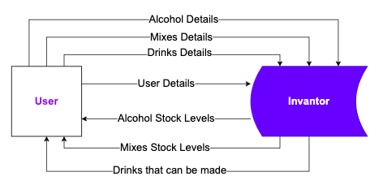

### **Level 1 DFD**

A further breakdown of the flow of data can been represented in the level 1 dataflow diagram. This diagram provides an insight of how the data flows from the user to each component of the application and how each component processes and uses the data to interact with the data stores in order to provide an output to the process and ultimately a response to the user.

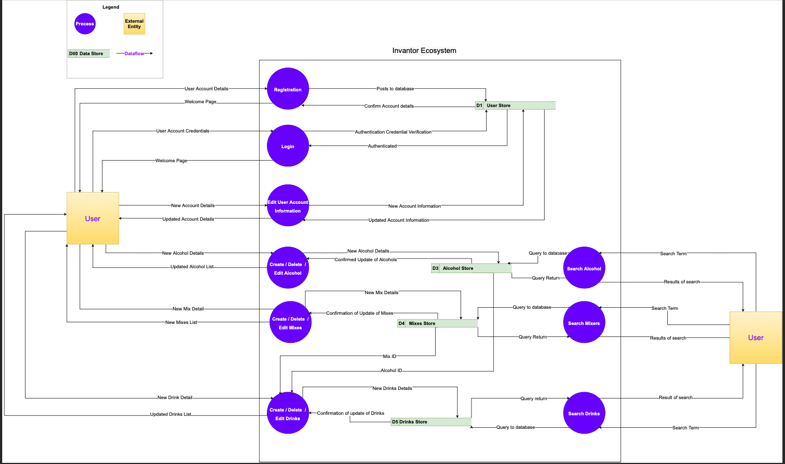

---

## **Entity Relationship Diagram**

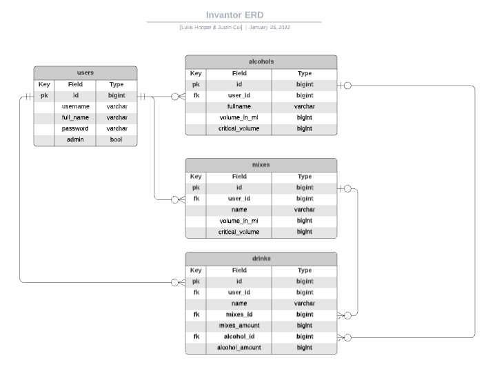

---

## **Application Architecture Diagram**

The diagram below shows the high level architecture and interactions between the technologies used for Invantor.

The layers presented are:

### **Client Layer**

Depicts the users that interact with Invantor through a web browsers on their desktops or mobile device which reside outside of the application ecosystem.

### **Presentation Layer**

Which is the front end that is hosted on Netlify and built with React.js. This allows the componentising of features and functions providing a fast display and user experience.

### **Business Logic Layer**

Which is the backend where all business logic, calculations and behaviours are defined. The business logic layer acts as the intermediary between the front end and the database when sending and recieving requests to ensure the correct data is being presented. Axios is used to send requests from the front end to the back end.

### **Database Layer**

All data will be stored in a structured sql database using Postgres. This database, once deployed to heroku will be hosted by AWS.

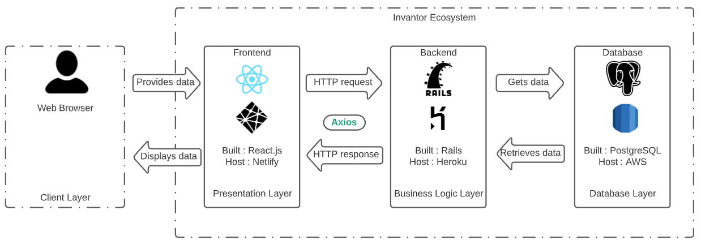

---

## **User Stories**

---

| Feature            | Requirement Key | Description                                                                                                                                                                                                                                                                                                                                                                               | Acceptance Criteria                                                                                                                                                                                                                                                                                                                                                                                    |
| ------------------ | --------------- | ----------------------------------------------------------------------------------------------------------------------------------------------------------------------------------------------------------------------------------------------------------------------------------------------------------------------------------------------------------------------------------------- | ------------------------------------------------------------------------------------------------------------------------------------------------------------------------------------------------------------------------------------------------------------------------------------------------------------------------------------------------------------------------------------------------------ |
| **Logins**         | US-1            | **As a user** <br/> **I want to** know that only people from my work place can access our information. <br/> **So that** i can rest assure that our information is safe and protected from unwanted access and modification.                                                                                                                                                              | <li> User authentication is required before accessing any features and functionalities of the app.<br/> <li> Invalid username and password combinations should return invalid credentials resulting in no access.                                                                                                                                                                                      |
| **Navigation Bar** | US-2            | **As a user** <br/> **I want to** be able to navigate around the application with ease <br/> **So that** i can access the information i need quickly.                                                                                                                                                                                                                                     | <li> Navigation bar should be avaiable and visible across all pages once authenticated<br/> <li> Links provided in the navigation bar should give users quick access to all other pages in the application.                                                                                                                                                                                            |
| **Help Section**   | US-3            | **As a user** <br/> **I want to** have access to a help section <br/> **So that** i can get information on how to use the application and the features available.                                                                                                                                                                                                                         | <li> There should be a help center link either in the nav bar or in the footer on every page.<br/> <li> The help center should have a FAQ section.<br/><li> The help center should have a list of all current features and a quick summary of what they do.<br/><li> The help center should have a contact service provider (Invantor) method to allow users to contact help services if issues arise. |
| **Stock Summary**  | US-4            | **As a user** <br/> **I want to** be able to quickly see a summary of my current stock levels for both spirits, mixes and the amount of drinks i can make from them (as 4 litres left doesnt mean much to me but if i knew that i could only make 20 more drinks then that is a good measure) <br/> **So that** i can keep track of my stock levels and know when things are running out. | <li> A chart / list of spirit stock should be available to view all spirits in the system as well as their stock levels.<br/> <li> A chart / list of mixes stock should be avaiable to view all mixes in the system as well as their stock levels.<br/><li> Viewing each spirit will provide a list of drinks as well as the number of those drinks the remaining stock can create.                    |
| **Stock Summary**  | US-5            | **As a user** <br/> **I want to** be alerted when my stock levels are low. <br/> **So that** i know when to order more.                                                                                                                                                                                                                                                                   | <li> A dashboard that displays all low in stock spirits and mixes.                                                                                                                                                                                                                                                                                                                                     |
| **Manage Spirits** | US-6            | **As a user** <br/> **I want to** able to create new spirits <br/> **So that** i can add to my spirits catalogue when new spirits become available.                                                                                                                                                                                                                                       | <li> The application must support the ability to add new spirits into the spirits catalogue by users.                                                                                                                                                                                                                                                                                                  |
| **Manage Spirits** | US-7            | **As a user** <br/> **I want to** be able to edit my existing spirits <br/> **So that** i can correct any mistakes and also adjust my stock accordingly after every day of trade.                                                                                                                                                                                                         | <li> The application must support the ability to edit existing spirit records in the system and allow users to make adjustments to stock levels as required.                                                                                                                                                                                                                                           |
| **Manage Spirits** | US-8            | **As a user** <br/> **I want to** be able to delete existing spirits from my catalogue <br/> **So that** I CAN remove any spirits that i no longer carry or sell.                                                                                                                                                                                                                         | <li> The application must support the ability to delete spirits from the spirits catalogue. <br/><li> On spirit delete, all dependant drinks are also deleted.                                                                                                                                                                                                                                         |
| **Manage Mixes**   | US-9            | **As a user** <br/> **I want to** able to create new mixes <br/> **So that** i can add to my mixes catalogue when new mixes become available.                                                                                                                                                                                                                                             | <li> The application must support the ability to add new mixes into the spirits catalogue by users.                                                                                                                                                                                                                                                                                                    |
| **Manage Mixes**   | US-10           | **As a user** <br/> **I want to** be able to edit my existing mixes <br/> **So that** i can correct any mistakes and also adjust my stock accordingly after every day of trade.                                                                                                                                                                                                           | <li> The application must support the ability to edit existing mixes records in the system and allow users to make adjustments to stock levels as required.                                                                                                                                                                                                                                            |
| **Manage Mixes**   | US-11           | **As a user** <br/> **I want to** be able to delete existing mixes from my catalogue <br/> **So that** i can remove any mixes that i no longer carry or sell.                                                                                                                                                                                                                             | <li> The application must support the ability to delete mixes from the mixes catalogue. <br/><li> On mix delete, all dependant drinks are also deleted.                                                                                                                                                                                                                                                |
| **Manage Drinks**  | US-12           | **As a user** <br/> **I want to** able to create new drinks <br/> **So that** i can add to my drinks catalogue when ni want to try and sell new drinks.                                                                                                                                                                                                                                   | <li> The application must support the ability to add new drinks into the drinks catalogue by users.                                                                                                                                                                                                                                                                                                    |
| **Manage Drinks**  | US-13           | **As a user** <br/> **I want to** be able to edit my existing drinks <br/> **So that** i can correct any mistakes and update drinks information and required ingredients to make in order to correctly reflect the usage of my mixes and spirits.                                                                                                                                         | <li> The application must support the ability to edit existing drinks records in the system and allow users to make adjustments as required to required spirit and mix amounts.                                                                                                                                                                                                                        |
| **Manage Drinks**  | US-14           | **As a user** <br/> **I want to** be able to delete existing drinks from my catalogue <br/> **So that** remove any drinks that i dont want to sell if the uptake on the drink is poorly recieved by my customers.                                                                                                                                                                         | <li> User must be able to fully delete existing drink records in the system                                                                                                                                                                                                                                                                                                                            |
| **General**        | US-15           | **As a stocktaker** <br/> **I want to** have a platfom that allows me to perform the stock take<br>**so that** i can inform my manager of the most up to date stock levels digitally.                                                                                                                                                                                                     | <li> Application needs to be mobile friendly in order to allow for the user to carry their mobile devices with them while doing stock take and be able to update as they go.                                                                                                                                                                                                                           |
| **Accessibility**  | US-16           | **As a user** <br/> **I want to** be able to search through my spirits and mixes list to find items i am looking for without having to scroll through my entire list.                                                                                                                                                                                                                     | <li> The application requires a search functionality for spirits, mixes and drinks.                                                                                                                                                                                                                                                                                                                    |

## **Future Iterations**

| Feature    | Requirement Key | Description                                                                                                                                                                                                                               | Acceptance Criteria                                                                                                                                                 |
| ---------- | --------------- | ----------------------------------------------------------------------------------------------------------------------------------------------------------------------------------------------------------------------------------------- | ------------------------------------------------------------------------------------------------------------------------------------------------------------------- |
| **Logins** | US-17           | **As a user** <br/> **I want to** be able to see graphical data on consumption trends of all my spirits and mixes <br/> **So that** i can paint a better and visual picture of how much inventory i use during different trading seasons. | <li> The Summary page needs to be able to generate a graphical repesentation of the selected spirit or mix and display a consumption line graph over set intervals. |

---

## **Wireframes**

### **Login**

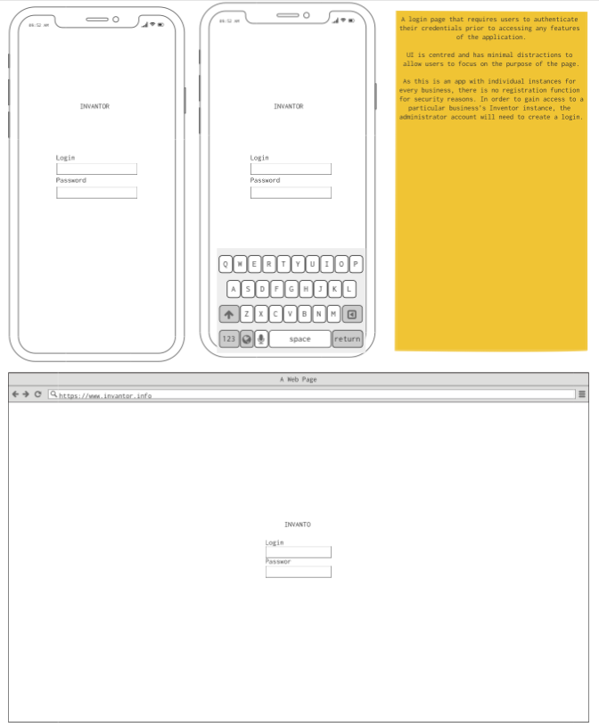

### **Home**

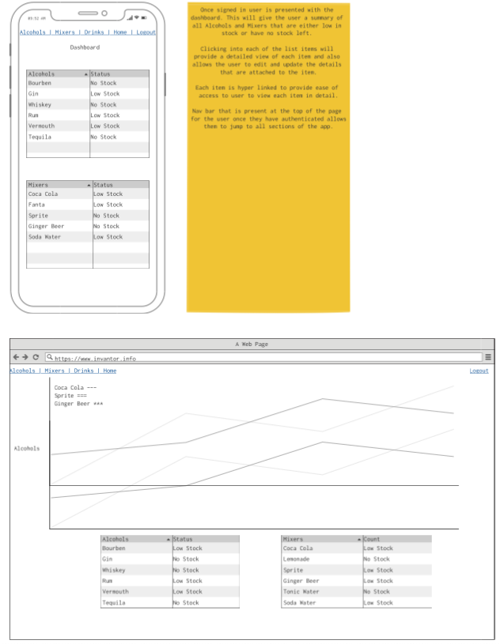

### **Alcohols and Mixers**

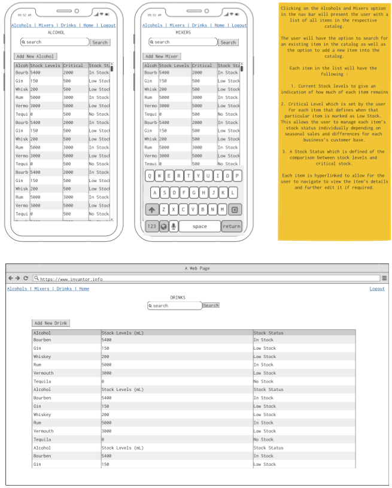

### **Edit / New Alcohol and Mixers**

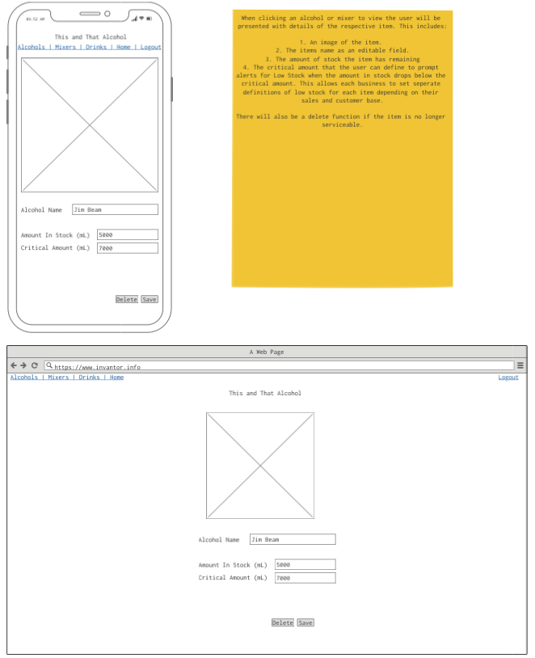

### **Drinks**

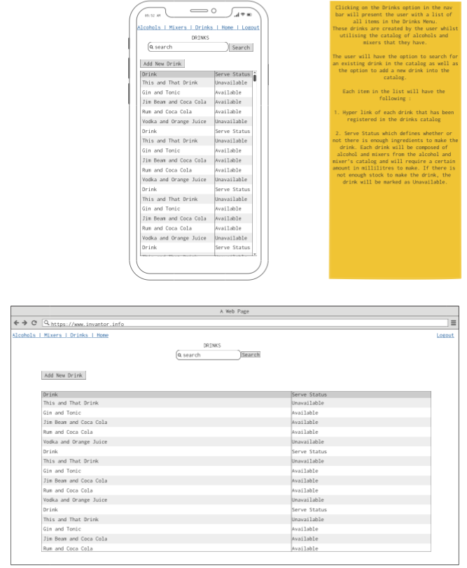

### **Edit / New Drinks**

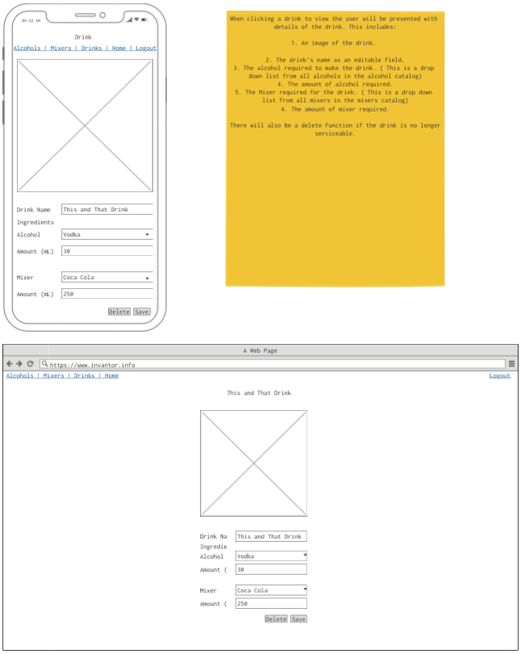

### **New User**

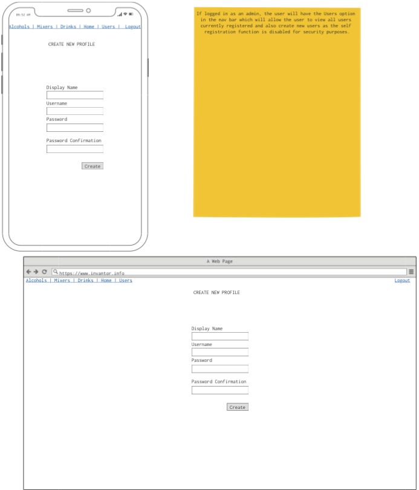

---

## **Project Management - Trello**

## Link : [Board](https://trello.com/b/hCvjwkJk/t3a2)

---

### **Day 1**

- Brain storm of Ideas
- Decisions on MVP for each Idea
- Risk assessment based on complexity and deliverability due to time lines
- Narrowing down of choices --> Inventory / Ingredients Tracker

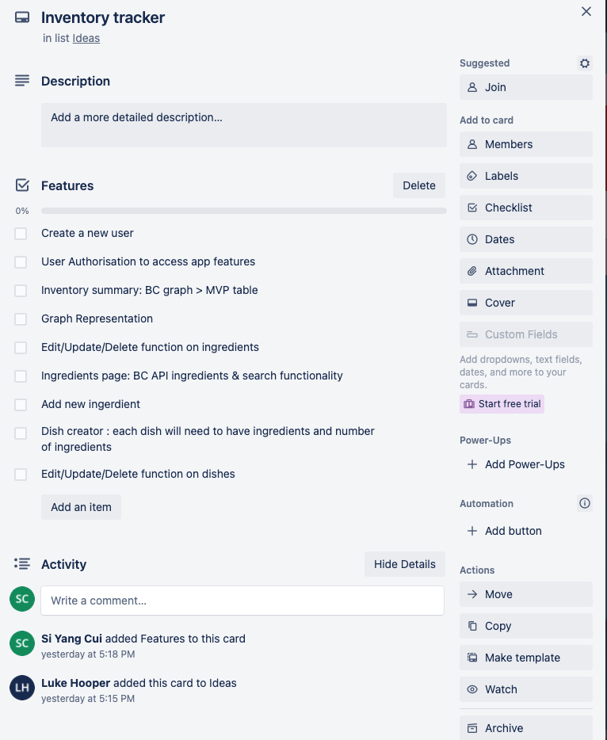

### **Day 2**

- Presentation with Anindha and Callum to pitch Idea. Idea was re-worked after input from Callum and Anindha, turned focus to inventory tracker for spirits and mixes and drinks for bars and pubs.

- Wireframes are in the process of being re-done.

- DFD lvl 0 and 1 have been done.
- ERD has been done.
- Currently working on Target Audience and User Stories.

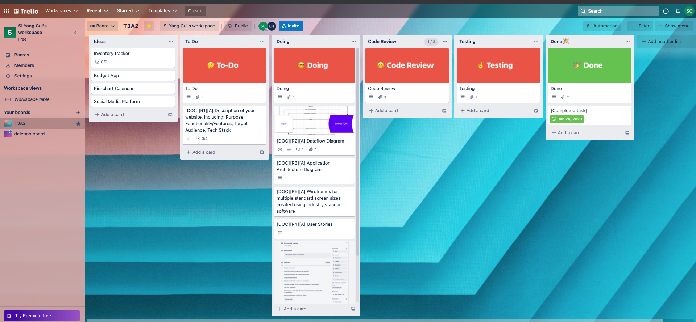
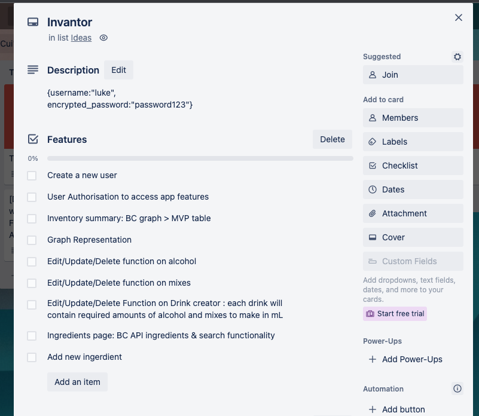
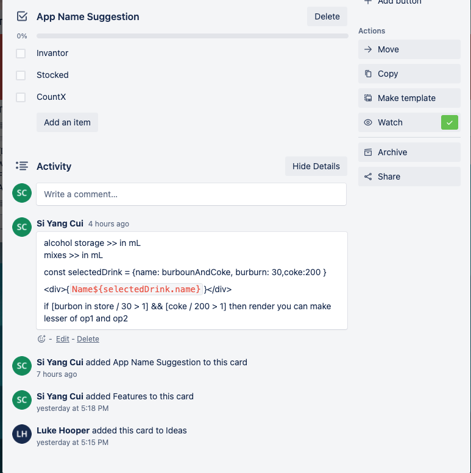

### **Day 3**

- Documented Purpose, Target Audience, Tech-stack and features.
- Documented User Stories.
- Updated level 0 and level 1 DFD.
- finished off AAD V1.
- Initialized readme repo.

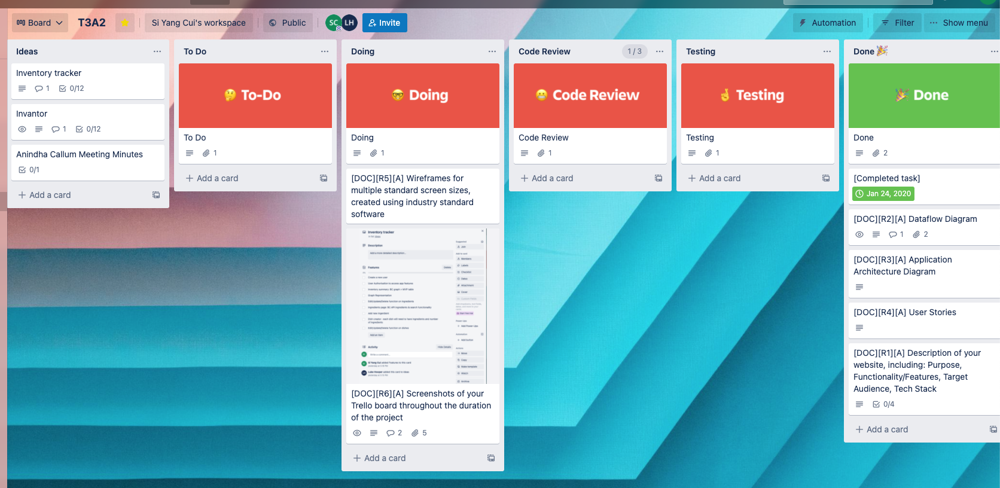

### **Day 4**

- Started working on design of of the database plus usage of JWT and Knock gem.
- Test run of models and relationships
- Tested API endpoints with http client for User and Alcohol.
- Got simple authorisation and authentication working via http

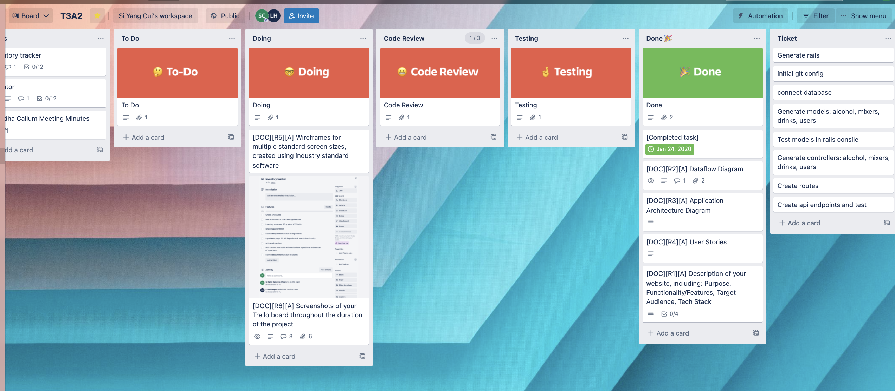

### **Day 5**

- Finalised model + relationships in the database.
- Second draft of fields of each model.
- Finished building controller actions for endpoints.
- Completed http files to test for endpoint responses.
- Tested with jwt authentication based on a private method for before_action to authenticate_user --- seems to be working.
- resolved jwt issue with secret keys currently still using knock but will wait till class on thursday to see if there is a better alternative.

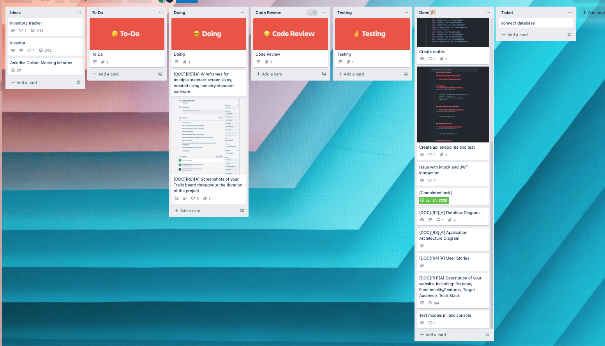

### **Day 6**

- Created tickets for components
- connect built simple APIs to ensure that front end is hitting the right endpoint via apis and data is being retrieved
- starting on CRUD functionalities for models

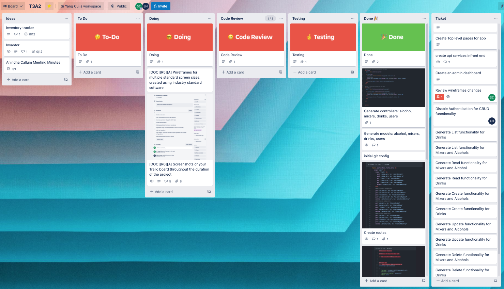

### **Day 7**

- Ported over create and read functionality to Mixers model.
- Edit function on mixers model work in progress
- Error message for Alcohols complete to be ported to other models
- Conflict resolution for two feature branch merges.
- updated user Create render to return userID

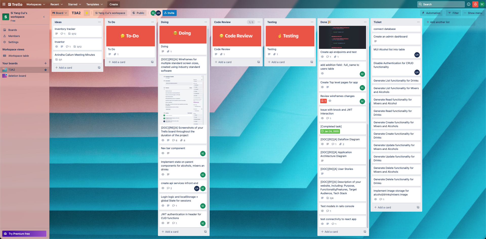

### **Day 8**

- Ported over create and edit error message fucntion from Alcohols in backend to allow for rendering of error messages for front end to consume
- Finalised functionality of editMixer design WIP
- Delete Alcohols functionality WIP
- Finalised presentation to present to class

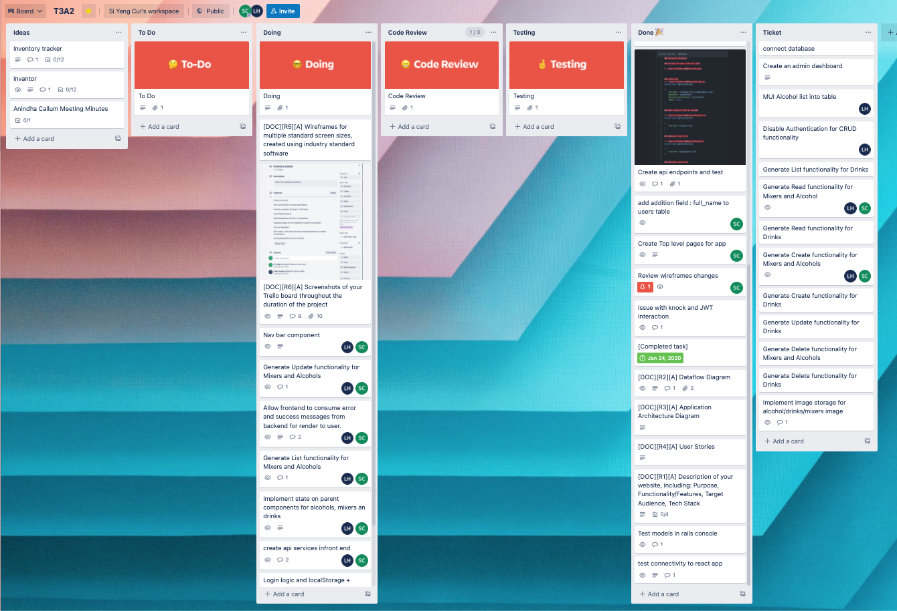

### **Day 9**

- Abstracted alert banner out in seperate component
- Imported banner into login component
- Changed user Model to remove full_name & include is_active
- Updated user controller logic to include is_active
- Updated frontend login logic to include is_active
- Ported over error message logic from alcohols controller into user controller
- Logout functionality
- Admin dashboard WIP
- Admin able to toggle user active status
- Cleaned our git tree
- Ported all func from mixers into alcohols,
- Added delete func from alcohol to mixer.
- Restructured the folders
- Created drinks show list
- Hooked-up creation backend with successful api connection for drinks creation
- Beginning of front end drink creation

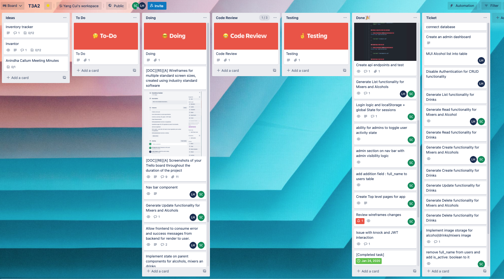

### **Day 10**

- Finished Create User Functionality.
- Added global themes to app.
- Finished a combined low stock HUD for home page that lists both mixers and alcohols in one table

### **Day 11**

- Fixed createDrinks initial form state issue
- Changed createDrinks form and fields to be controlled components
- WIP for button to increase drinks sold

### **Day 12**

- Deployment to Heroku for backend Deployment to Netlify for frontend
- Re-configured loading logic due to errors picked up in Cypress Tests Started writing tests with cypress

### **Day 13**

- Created shared components for mixers and alcohols and removed duplicate code to try and DRY up code.

### **Day 14**

- implemented CSV download function for low stock
- added styling
- added image logo to login page

---

## **Starting up and Testing - Rspec and Cypress**

---

Clone both frontend and backend repos to your local machine by running the following commands after you have navigated to a preferred location on your device.

```
git clone <clone address>
```

Navigate to the backend repo on your local machine and run the following command to install all dependancies:

```
bundle i
```

Navigate to the frontend repo on your local machine and run the following command to install all dependancies:

```
npm i
```

To begin with the loading of the project it is essetial to create your own set of credentials. This can be achiieved by deleting the credentials.yml.enc in the backend and then typing in the backend:

```
EDITOR="code --wait" rails credentials:edit
```

This will populate a new key and then the process is almost up and running. The next step that youll have to do is create the database. If you already have a simularly named database on your database you will have to drop it first before creating, migrating and seeding the database:

```
rails db:drop db:create db:migrate db:seed
```

Before the comencment of testing ensure that the database is up to date and that no changes have been made to it. The line above will ensure that the database is in a ready state.

Next to test the backend database run:

```
be rspec spec
```

This will create for you a coverage report which can be viewed by running:

```
open coverage/index.html
```

To test on the front end you will nedd to spin up the backend and front end, by running:

```
rails s

# If you are having port conflicts, you can start up the backend and define a port by typing rails s -p 5000
```

On the backend and then on the frontend running:

```
npm run dev
```

Now that both environment are up and running open up another shell in the front end and run the command:

```
npm run cypress:open
```

This should prompt you to download, then upon open point the the GUI whereby the tests can be run.

Use the following details to log in :

```
username: admin@admin.com
password: password123

```

---

## **Testing Specifications**

---

### **End-to-end => Cypress**

### **Backend => Rspec**

**UAT: [Manual Testing](https://docs.google.com/spreadsheets/d/1iyC8HeFDx3LkPsnSmCSpEw4ybCZ7ylOLibtcI7zX4Kk/edit?usp=sharing)**

---

## **Project Changes since Part A**

### **Features**

- Initial implementation quoted a Help Center in the navigation bar -> This was not released due to the time constraint and also the fact that the app itself is very straight forward and will not require a guide.

- Intial Wireframes quoted a "Show" page with an image of each drink, mixer and alcohol. This was later revised as images was not deemed as an MVP feature that would have disadvantaged core app functionality. This will be implemented as a future rendition of the app.

### **UI**

Throughout the project's timeline, layout to the user interface had changed. This is due to the difference in wireframe assumptions and actual UX when using the application. The UI has been changed in order to better tailor to the usability of the app without having to click around too much. This was acheived through agile methodology using very short sprints when developing, redeveloping and implementing UI based on optimum UX.

### **Tech Stack Update**

Additional technologies used for the app are:

- Cypress for end to end testing
- Rspec for backend testing.
